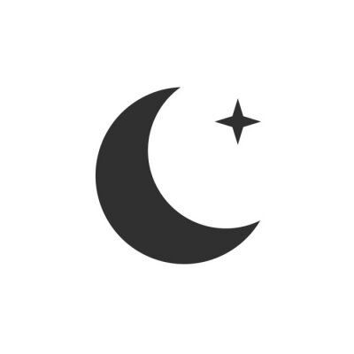

# The Moon Programming Language
**moon** is a simple dynamically-typed stack-oriented programming language. Something I created for fun and to learn how stack-oriented programming language works.

# Example
```
"Hello, how are you?\n" // push string to stack
cout // pop string from stack, write it to console output
```

### Work In Progress
